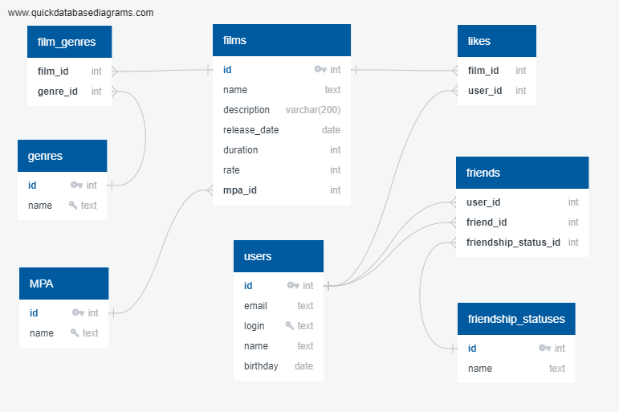

# java-filmorate

**Filmorate** - бэкенд сервиса для работы с фильмами и оценками пользователей.

## Техническое описание

### Модели
* **Film** - фильмы
* **User** - пользователи
* **Genre** - жанры
* **RatingMPA** - рейтинг, присвоенный MPA
* **Likes** - информация о лайках пользователей к фильмам
* **Friends** - информация об отношении дружбы пользователей друг с другом
* **FriendshipStatus** - статусы отношения дружбы ('waiting' , 'agree')

### Связи между моделями (ER-diagram)


**Примеры запросов для основных операций**
* Получение списка всех фильмов
```
SELECT *
FROM film;
```

* Получение 10 наиболее популярных фильмов (id и название) по количеству лайков
```
SELECT film_id,
       name
FROM film
ORDER BY number_of_likes DESC
LIMIT 10;
```

* Получение пользователя с id=17
```
SELECT *
FROM user
WHERE user_id=17;
```

* Получение списка друзей (id и login) пользователя с id=17
```
SELECT u.user_id,
       u.login
FROM user u
INNER JOIN friends f
    ON u.user_id = f.agreed_user_id AND f.proposed_user_id = 17 OR
       u.user_id = f.proposed_user_id AND f.agreed_user_id = 17 
INNER JOIN friendshipstatus fs
    ON f.friendship_status_id = fs.friendship_status_id AND fs.value = 'agree';
```

* Получение списка общих друзей (id и login) пользователей с id=3 и id=17
```
SELECT u.user_id,
       u.login
FROM user u
INNER JOIN friends f
    ON (u.user_id = f.agreed_user_id AND f.proposed_user_id = 17 OR
       u.user_id = f.proposed_user_id AND f.agreed_user_id = 17) AND
       (u.user_id = f.agreed_user_id AND f.proposed_user_id = 3 OR
       u.user_id = f.proposed_user_id AND f.agreed_user_id = 3)
INNER JOIN friendshipstatus fs
    ON f.friendship_status_id = fs.friendship_status_id AND fs.value = 'agree';
```

### Пользовательские роли
Пользователи равноправны. Регистрация происходит по обязательным полям email и login.

### Функциональные возможности
**Фильмы**
* добавление/обновление фильма
* указание для фильма жанра(жанров) и рейтинга MPA
* получение списка всех фильмов
* получение фильма по его уникальному идентификатору (id)

**Пользователи**
* добавление/обновление пользователя
* получение списка всех пользователей
* получение пользователя по его id

**Лайки**
* добавление/удаление пользователем лайка к фильму
(каждый пользователь может поставить лайк фильму один раз)
* получение указанного количества наиболее популярных фильмов по количеству лайков (по умолчанию - 10 фильмов)

**Отношения дружбы между пользователями**
* приглашение пользователем другого пользователя в друзья (неподтверждённая дружба)
* согласие на дружбу с другим пользователем (подтверждённая дружба)
* получение списка друзей пользователя по его id
* получение списка общих друзей двух пользователей

## Технологии в проекте
* Java v.11.0.16
* Spring Boot
* Postgres
* REST API
